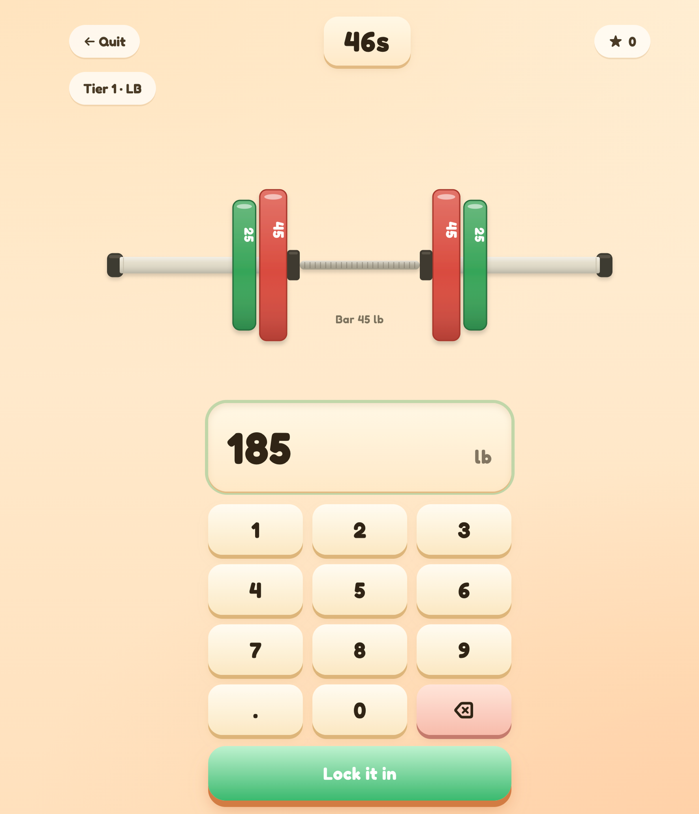

# Plate Math 🏋️

A bite-sized game for getting fast at mental barbell math. I made this because
I was bad at doing the mental math on what weight was on the barbell and thought
I'd get better by grinding it out with a game. Truly I feel zyzz would be proud.

**Play:** https://platemath.fun

<p align="center">
  
</p>

## Tech

- **[TanStack Start](https://tanstack.com/start)** (React 19, Vite) on **Cloudflare Workers**
- **[Convex](https://convex.dev)** for the global high-score leaderboards

## Develop

```bash
pnpm install
pnpm dev        # runs Convex + Vite together
```

Create a `.env` with your own keys:

```
VITE_PUBLIC_POSTHOG_PROJECT_TOKEN=phc_...   # PostHog project (client) key — safe to ship
VITE_PUBLIC_POSTHOG_HOST=https://us.i.posthog.com
```

`pnpm dev` provisions a local Convex deployment and writes `VITE_CONVEX_URL` to
`.env.local` automatically on first run.

## Project layout

```
convex/            # schema + leaderboard query/mutations (scores.ts)
src/game/          # round generation, scoring, sound, share helpers, state
src/components/    # Barbell (SVG), Landing, RoundScreen, leaderboards, etc.
src/routes/        # TanStack Start routes; __root.tsx wires the providers
```

## Deploy

```bash
# Pushes Convex functions to prod + builds the frontend against the prod URL,
# then uploads the Cloudflare Worker.
npx convex deploy --cmd 'pnpm run build' --cmd-url-env-var-name VITE_CONVEX_URL
pnpm exec wrangler deploy
```

Requires `CONVEX_DEPLOY_KEY` (production) and a Cloudflare login or
`CLOUDFLARE_API_TOKEN` in the environment.

## License

MIT
